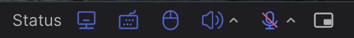
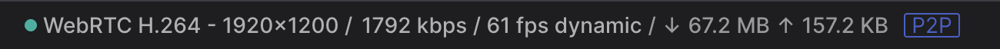
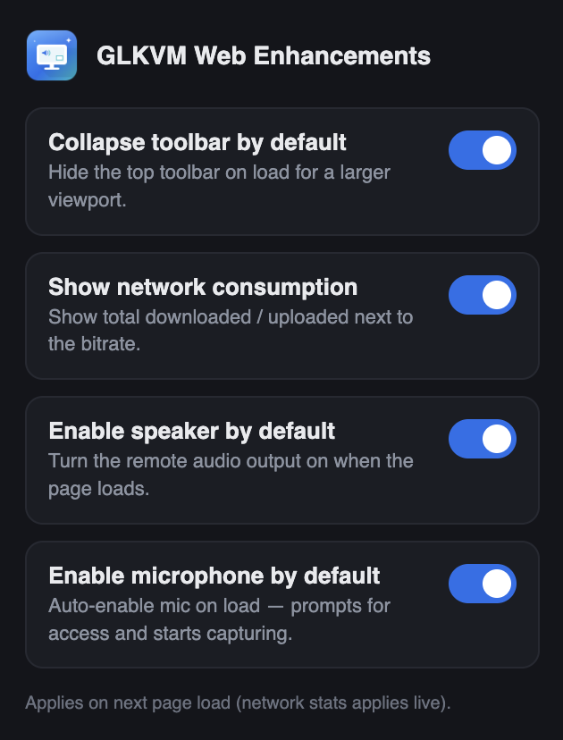

<div align="center">


# GLKVM Web Enhancements

Quality-of-life additions for the [GL.iNet GLKVM](https://www.gl-inet.com/products/gl-rm1/) web interface — speaker/mic device selection, Picture-in-Picture, live data totals, and a tidier toolbar.

A single, dependency-free MV3 content script for Chromium browsers (Chrome / Edge / Brave).

</div>

---

## Why

The GLKVM web UI is great, but it always uses your system's **default** speaker and microphone, has no Picture-in-Picture, and the toolbar takes up space. Its frontend is closed-source (shipped as a minified bundle), so these gaps can't be patched directly. This extension layers the missing controls on top of the live page without touching its code.

## Features

| | Feature | How it works |
|---|---|---|
| 🔊 | **Speaker picker** | Route KVM audio to any output device via `setSinkId`, re-applied whenever audio (re)starts. |
| 🎤 | **Microphone picker** | Forces the chosen input by hooking `getUserMedia`; hot-swaps the live track if the mic is already streaming. |
| 🖼️ | **Picture-in-Picture** | Pops the remote screen into a floating, always-on-top window — with a "Bring video back" overlay so you can exit PiP from the otherwise-black page. |
| 📊 | **Data totals** | Shows total downloaded / uploaded for the session, read from WebRTC `getStats()`, next to the bitrate. |
| 🧹 | **Auto-collapse toolbar** | Collapses the top toolbar on load and centers the expand handle. |
| 🔈 | **Speaker / mic on by default** | Optionally enable the remote speaker and/or microphone automatically when the page loads. |
| ⚙️ | **Options page** | Toggle each behavior on/off; preferences sync across your Chrome profile. |

The device pickers appear as small chevrons next to the existing speaker/mic icons in the bottom status bar, plus a Picture-in-Picture button:



The session data totals sit inline with the stream info:



## Install

This is an unpacked extension (not on the Web Store).

1. Download or clone this repository.
2. Open `chrome://extensions` (or `edge://extensions`).
3. Enable **Developer mode**.
4. Click **Load unpacked** and select the project folder.
5. Open / refresh your GLKVM tab. On first use, click a device chevron and **allow microphone access once** so Chrome reveals device names.

> Running GLKVM as a window? **⋮ → Cast, Save, and Share → Create Shortcut… → "Open as window"** gives an app-like window. The content script injects there too.

## Configuration

By default the script runs on `glkvm.local` and any Tailscale (`*.ts.net`) host. If you reach your KVM another way (LAN IP, custom hostname), add it to `content_scripts[0].matches` in `manifest.json`:

```json
"matches": [
  "https://glkvm.local/*",
  "https://*.ts.net/*",
  "https://192.168.1.50/*"
]
```

Then reload the extension.

## Options

**Click the toolbar icon** to open the settings popup. Each feature can be toggled independently:

<p align="center"></p>

- **Collapse toolbar by default**
- **Show network consumption**
- **Enable speaker by default**
- **Enable microphone by default** (off by default — turning this on prompts for mic access and starts capturing on every load)

Settings are stored in `chrome.storage.sync` and apply on the next page load; the network-stats toggle applies live. The popup talks to `chrome.storage`, while the main script runs in the page's MAIN world (no `chrome.*` access) — a small isolated-world bridge mirrors the settings between them.

## How it works

The script runs in the page's **MAIN world** at `document_start`, so it is in place before the SPA initializes WebRTC:

- Wraps `navigator.mediaDevices.getUserMedia` to inject the selected microphone `deviceId`.
- Wraps the `RTCPeerConnection` constructor to track connections (the KVM video stream is receive-only, so `addTrack` is never called) — used for live mic swapping and reading transfer stats.
- Manipulates the existing `<video>` / `<audio>` elements directly for output routing and PiP.
- Re-injects its UI via a `MutationObserver` if the Vue-rendered status bar re-mounts.

Selections persist in `localStorage`. **No data leaves your browser** — there are no network requests, analytics, or external dependencies, and the extension requests no special permissions beyond the host match.

## Compatibility

- **Chromium browsers (Chrome 111+, Edge, Brave):** full support — MV3 `world: "MAIN"` content scripts are required.
- **Safari:** the script logic is portable, but Safari needs an Xcode wrapper and its `setSinkId` support is limited; not packaged here.

## Limitations

- Output (speaker) selection requires the page to be actively playing audio; it's applied on the next `play` event.
- Microphone selection applies live if a mic is already active, otherwise on the next time the mic is enabled.
- Data totals reflect the current WebRTC connection and reset on reconnect.

## License

[MIT](LICENSE)

---

<sub>Not affiliated with or endorsed by GL.iNet. "GLKVM" is a trademark of its respective owner.</sub>
